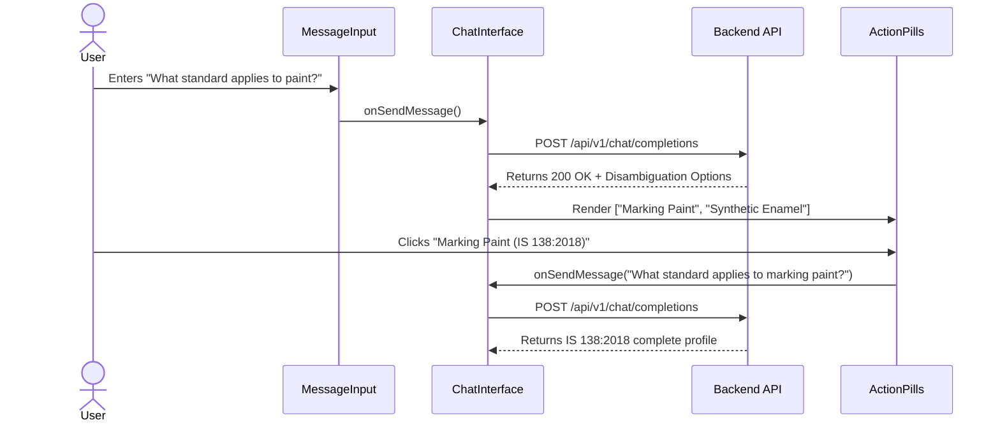

# Conversational Chat Interface

The `ChatInterface` coordinates user input, message threading, streaming indicators, and action button callbacks.

```mermaid
sequenceDiagram
    actor User
    participant Input as MessageInput
    participant Chat as ChatInterface
    participant API as Backend API
    participant Pills as ActionPills

    User->>Input: Enters "What standard applies to paint?"
    Input->>Chat: onSendMessage()
    Chat->>API: POST /api/v1/chat/completions
    API-->>Chat: Returns 200 OK + Disambiguation Options
    Chat->>Pills: Render ["Marking Paint", "Synthetic Enamel"]
    User->>Pills: Clicks "Marking Paint (IS 138:2018)"
    Pills->>Chat: onSendMessage("What standard applies to marking paint?")
    Chat->>API: POST /api/v1/chat/completions
    API-->>Chat: Returns IS 138:2018 complete profile
```
